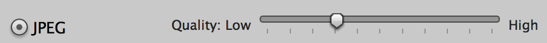
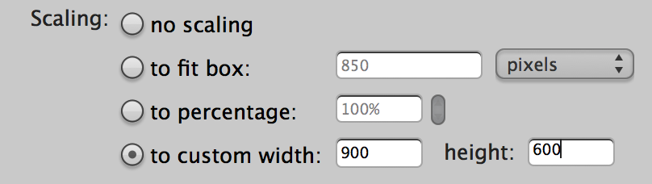
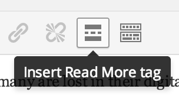
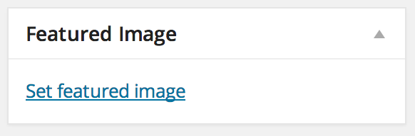

### Image sizing

Resize images to fit 900x600px on the longest edge, saved at JPG quality 6.

### Read more links

Insert a Read More tag to display the rest of a post after the jump.

### Featured image

To display an image above the post title, set it as the post's Featured Image.

