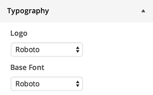
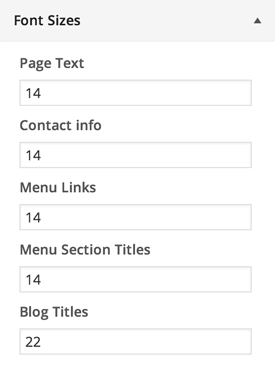
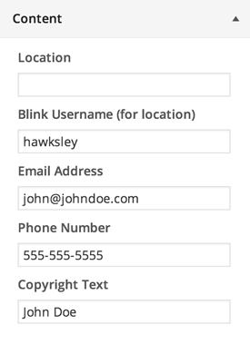
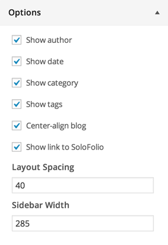
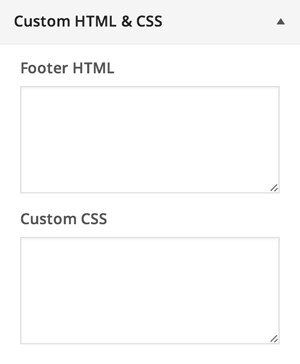
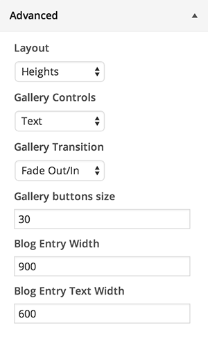

# Customizer
SoloFolio uses the built-in WordPress theme Customizer to configure the look and feel of your site.

## Logo
### Logo
Upload your logo here. For best results, use a transparent PNG file at retina (2x) resolution.

### Width
Display width of the logo image. Should be 1/2 of uploaded image width to accomodate retina displays.

### Favicon
Used in the title bar next to your page title. Upload a 32x32px PNG file.

## Colors
Used to select colors for use throughout your site.

## Typography

### Logo font
Font family used for logo (if no image is uploaded).

### Base font
Font family used throughout site.

## Font Sizes

## Content

### Blink username
Loads location from Blink username, overriding manually set location.

### Location, Email, Phone Number
Displayed with logo.

### Copyright Text
Displayed after © and the current year. Example: Joel Hawksley/The Roanoke Times

## Options

### Show category, date, author, tags
Toggle display of category, date, author, and tags on blog posts.

### Show link to SoloFolio
Toggle display of attribution link in footer.

### Center blog layout
Toggle centering of blog pages on large displays.

### Layout Spacing
Spacing around outside of layout.

### Sidebar Width
Change width of sidebar to accomodate different logo sizes.

## Custom HTML &amp; CSS

### Footer HTML
Insert tracking code (such as Google Analytics) here.

### Custom CSS
em For advanced users only
Custom CSS rules for additional design customization.

## Advanced

### Layout
Toggle layout mode between Heights (default) and Horizon (tonavigation bar).

### Gallery Controls
Switch between text labels or buttons for gallery controls.

### Gallery Transition
Set the default transition for galleries.

### Gallery buttons size
Change size of gallery buttons (if enabled).

### Blog entry width
Greatest width that blog images will be constrained to.

### Blog text width
Greatest width that blog text will be constrained to.

