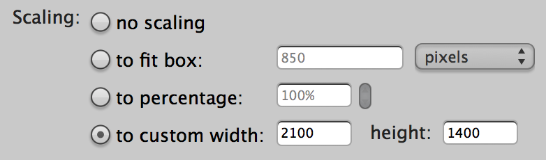
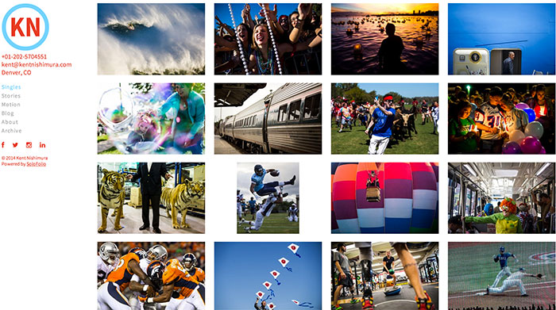
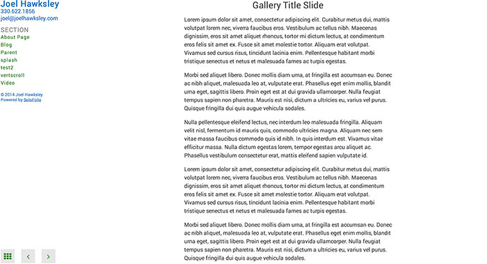
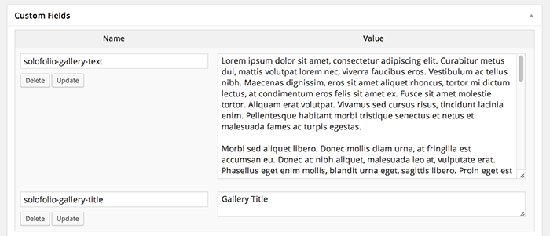

# Galleries

### Pages: Add new
Give the page a title. Do not add body text content.
Resize images to fit 2100x1400px on the longest edge, saved at JPG quality 6.

### Add Media > Insert Gallery
Upload images and insert captions.
em Note: Link To and Columns options in Gallery Settings are not used by SoloFolio.

## Auto Play
To make a gallery automatically advance, go to the Text view for the page, then add the following code to the gallery shortcode:
`[gallery ids="..." autoplay="true" speed="3000"]`
Where the value for speed is the time in milliseconds that each image should be shown.

## Show Thumbnails by Default

To show thumbnails by default, go to the Text view for the page, then add the following code to the gallery shortcode:

`[gallery ids="..." thumbs="true"]`

## Title Slides

To add a title slide to a gallery, set the solofolio-gallery-title and solofolio-gallery-text custom fields.

