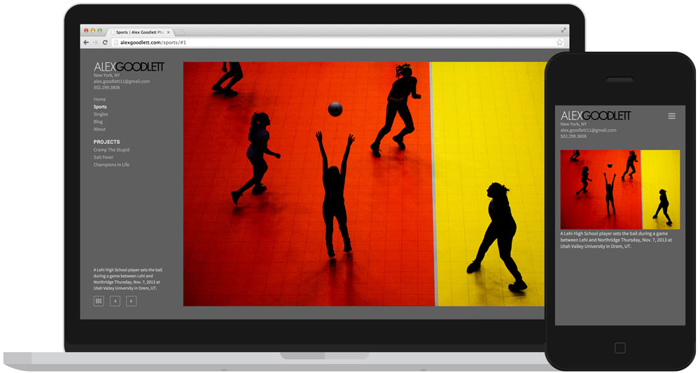

Built with the specific needs of photojournalists in mind, SoloFolio makes it easy to create the perfect WordPress portfolio & blog.

### Features
- Retina-friendly, fully responsive galleries
- Images are never cropped, captions are always visible
- No-compromises experience for mobile/tablet users
- Custom widgets for dropdown menus and social media icons
- Works on screens of all sizes from 3" to 30"
- Compatible with [WooCommerce](http://www.woothemes.com/woocommerce/) eCommerce Toolkit
- Integrates with [Photoshelter BEAM](http://www.photoshelter.com/tour/beam) Element template
- Loads real-time location from [Blink](http://www.blink.la/)

### Examples
- [Matt Eich](http://www.matteichphoto.com) / Norfolk, VA
- [Harry Engels](http://www.harryengels.com) / London, UK
- [Joshua Lindsey](http://www.joshualindsey.com) / Nashville, Tenn.
- [Gabe Souza](http://www.gabevsouza.com) / Portland, Maine
- [Joel Hawksley](http://www.hawksleyvisuals.com) / Providence, R.I.
- [Jordan Stead](http://www.jordanstead.com) / Seattle, Wash.
- [Jared Wickerham](http://www.wickphotography.com) / Pittsburgh, P.A.

