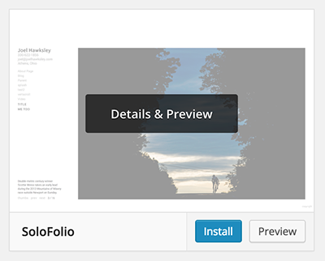

# Installation

Before you get started, you'll need a copy of Wordpress 4.0+ running on a server. Most web hosts make it easy to get an installation up and running. I recommend [Dreamhost](http://www.dreamhost.com).

If you haven't already, [download](http://github.com/joelhawksley/SoloFolio/archive/master.zip) the latest version of SoloFolio.

Copy the theme to /wp-content/themes.

Under Appearance > Themes, Click "Activate" for SoloFolio.

