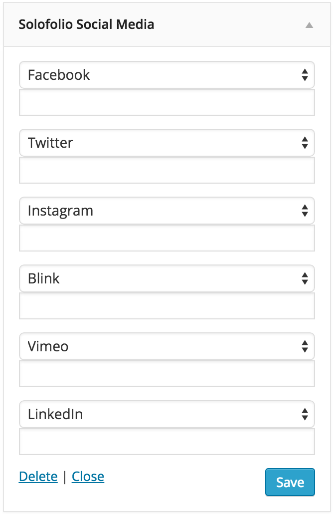

_SoloFolio does not support default menus. They must be added via the Custom Menu widget._

### Menus

1. Go to Appearance > Menus
2. Create a menu for each section of pages. (For example: Home, Projects, Multimedia)
3. Add pages to menus
4. Go to Appearance > Widgets
5. Add a Custom Menu widget to the Main Navigation widget area
6. Add a title to the menu widget to display above the menu

_Note: Only one menu widget should be used with the Horizon layout._

### Dropdown menu
To create a dropdown menu, use the SoloFolio Dropdown Widget instead of the Custom Menu widget. The widget's Title field will display as the menu title, which will open the menu when clicked.

### Social media links
1. Go to Appearance > Widgets
2. Add the SoloFolio Social Media widget to the Main Navigation widget area
3. Add your social media links to the widget

