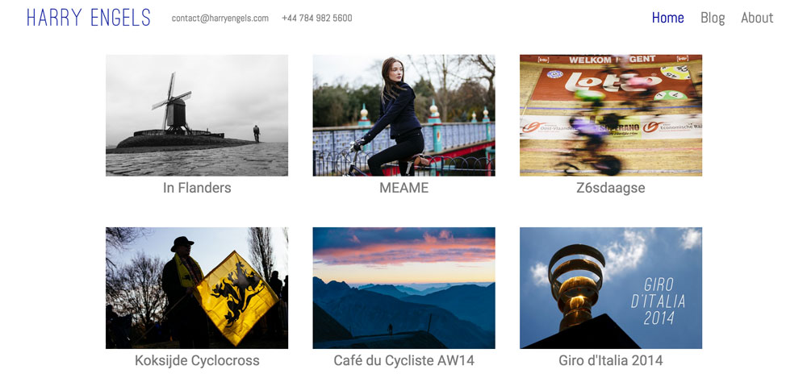

1. Go to Pages > Add new
2. Select "Parent Page" from the Template dropdown
3. Publish page
4. For each child page, set the parent page to the one created above
5. For each child page, set the Featured Image to pick the thumbnail.
6. For each child page, set Order to sort the pages, which will be displayed from lowest to highest Order value.
