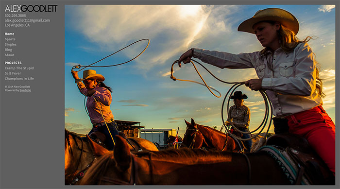

Splash page in use on [http://www.alexgoodlett.com](http://www.alexgoodlett.com)

1. Go to Pages > Add new
2. Click on Add Media, then Insert Gallery
3. View page as HTML, and in the [gallery] shortcode, add:

`type="vert-scroll"`

Example: `[gallery ids="97,75,77" type="vert-scroll"]`

To hide the image caption, add `captions="false"`
