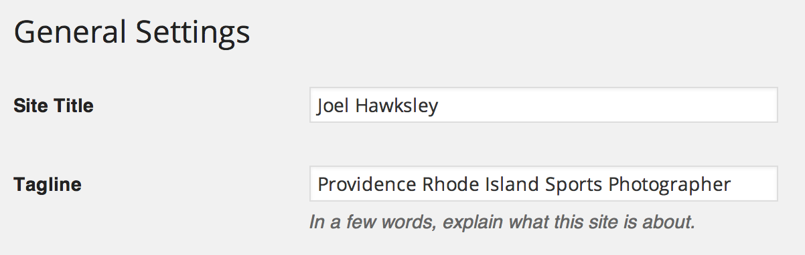
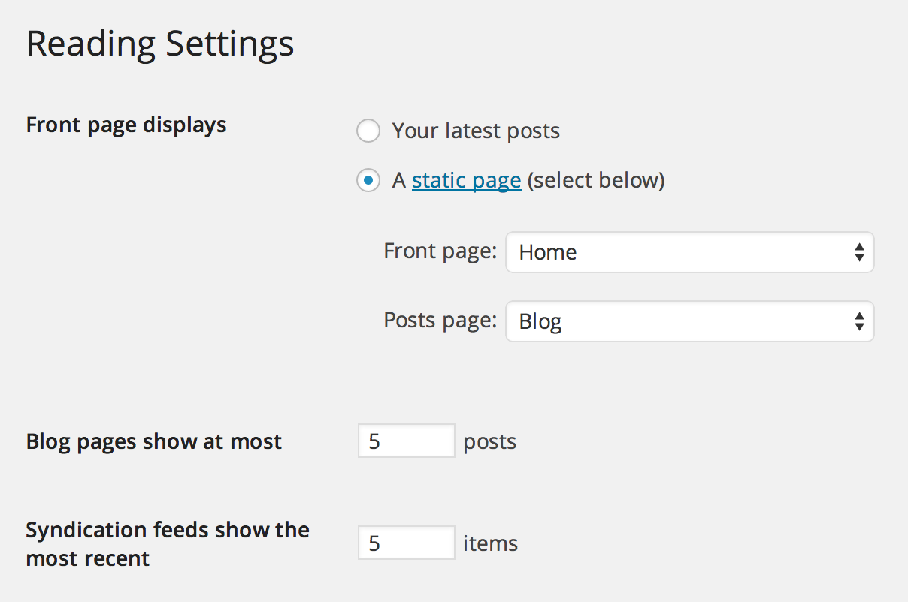
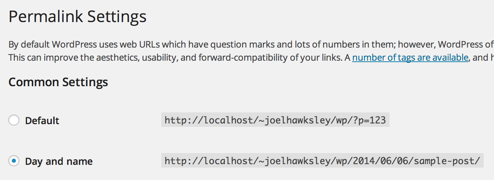

### General

__Site title__

Your name, used in page titles.

__Tagline__

Short site description, used in page titles.

### Reading

Select Static Page, and choose a page to use as your Front page. Create an empty page named Blog and select it for Posts page.

### Permalinks

Select day and name.

